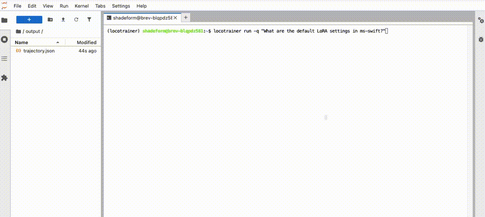

<div align="center">
  
</div>

<br>

<div align="center">

[](https://pypi.org/project/locotrainer/)
[](https://huggingface.co/LocoreMind/LocoTrainer-4B)
[](https://huggingface.co/LocoreMind/LocoTrainer-4B-GGUF)
[](https://colab.research.google.com/github/LocoreMind/LocoTrainer/blob/main/LocoTrainer_4B.ipynb)
[](https://github.com/LocoreMind/LocoTrainer)

</div>

> **LocoTrainer-4B** is a 4B-parameter MS-SWIFT domain expert agent distilled from Qwen3-Coder-Next. Designed to analyze MS-SWIFT codebases and generate comprehensive markdown reports — combining tool-calling capabilities with deep framework knowledge.

## 🎬 Demo

<div align="center">
  
</div>

*LocoTrainer analyzing MS-SWIFT codebase with LocoTrainer-4B model via vLLM*

## 📋 Table of Contents

- 📰 [News & Updates](#-news--updates)
- 📝 [Introduction](#-introduction)
- ✨ [Key Features](#-key-features)
- 🏗️ [Architecture](#️-architecture)
- 📈 [Performance](#-performance)
- 🚀 [Quick Start](#-quick-start)
- 🔧 [Usage Examples](#-usage-examples)
- 📁 [Project Structure](#-project-structure)
- ⚠️ [Known Limitations](#️-known-limitations)
- 📄 [License](#-license)
- 🙏 [Acknowledgments](#-acknowledgments)

## 📰 News & Updates

- **\[2026-03-13\]** 🚀 LocoTrainer-4B and LocoTrainer framework released.

## 📝 Introduction

LocoTrainer-4B is a specialized code analysis agent trained via knowledge distillation from **Qwen3-Coder-Next**. Unlike general-purpose code agents, it combines multi-turn tool-calling capabilities with deep MS-SWIFT framework knowledge, enabling it to generate comprehensive codebase analysis reports without requiring a separate reasoning model.

<div align="center">

|  | LocoTrainer-4B |
|:--|:--:|
| **Base Model** | [Qwen3-4B-Instruct-2507](https://huggingface.co/Qwen/Qwen3-4B-Instruct-2507) |
| **Teacher Model** | Qwen3-Coder-Next |
| **Training Method** | Full-parameter SFT (distillation) |
| **Training Data** | 361,830 samples (agent trajectory + MS-SWIFT knowledge + project paths) |
| **Max Sequence Length** | 32,768 tokens |
| **Training Hardware** | 8x NVIDIA H100 80GB |
| **Training Time** | ~25 hours |
| **Framework** | MS-SWIFT |

</div>

## ✨ Key Features

- 🎯 **MS-SWIFT Domain Expert**: Trained on MS-SWIFT documentation, CLI parameters, and project structure — answers framework questions accurately without hallucination
- 🔧 **Tool-Calling Agent**: Generates structured `<tool_call>` JSON for Read, Grep, Glob, Bash, and Write tools
- 📊 **End-to-End Reports**: From a single question to a complete, well-structured markdown analysis report
- 🏠 **Local Deployment**: GGUF quantized, runs on Mac Studio via llama.cpp at zero API cost
- 📏 **Long Context**: 32K training covers 90% of long-context analysis scenarios
- 🔄 **Auto Clone**: Automatically clones ms-swift on first run — no manual setup needed

## 🏗️ Architecture

LocoTrainer consists of two components: the **agent framework** (this repo) and the **LocoTrainer-4B model**.

```
User Query
    │
    ▼
LocoTrainer Framework
    ├── build_user_query()     # injects absolute paths
    ├── get_system_reminder()  # simulates Claude Code environment
    └── Agent Loop
            │
            ▼
    LocoTrainer-4B (or any OpenAI-compatible model)
            │
            ├── <tool_call> Read / Grep / Glob / Bash
            │       │
            │       ▼
            │   Real Filesystem (ms-swift codebase)
            │       │
            │       ▼
            └── <tool_response> → next turn
                    │
                    ▼
            output/output.md   (final markdown report)
            output/trajectory.json  (full conversation log)
```

The framework simulates a Claude Code-style agent environment, which is exactly what LocoTrainer-4B was trained on — ensuring maximum compatibility between the model and the runtime.

## 📈 Performance

Evaluated on MS-SWIFT codebase analysis tasks across 3 test iterations.

### Agent Loop Reliability

| Metric | Test 1 (Relative Paths) | Test 2 (Absolute Paths) | Test 3 (Absolute + Tolerant Args) |
|:-------|:-----------------------:|:-----------------------:|:---------------------------------:|
| Read success rate | 0% | 100% | 100% |
| Write success rate | — | 0% | 100% |
| Turns used | 15 (limit) | 15 (limit) | 9 |
| Tool calls | 34 | 27 | 13 |
| output.md generated | ✗ | ✗ | ✓ (225 lines) |

### Key Design Insight

> **Absolute paths in user content + tolerant tool argument parsing = reliable agent behavior.**
>
> This mirrors Claude Code's own design: the system always provides full absolute paths so the model never has to guess.

## 🚀 Quick Start

### Option 1: One-Line Setup (Recommended)

We provide automated setup scripts for different scenarios:

**For most users (cloud API)**:
```bash
curl -O https://raw.githubusercontent.com/LocoreMind/LocoTrainer/main/scripts/setup_locotrainer.sh
chmod +x setup_locotrainer.sh
./setup_locotrainer.sh
```

**For GPU users (local vLLM + LocoTrainer-4B)**:
```bash
curl -O https://raw.githubusercontent.com/LocoreMind/LocoTrainer/main/scripts/setup_locotrainer_vllm.sh
chmod +x setup_locotrainer_vllm.sh
./setup_locotrainer_vllm.sh
```

**For developers (from source)**:
```bash
git clone https://github.com/LocoreMind/LocoTrainer.git
cd LocoTrainer
./scripts/setup_locotrainer_dev.sh
```

See [scripts/README.md](scripts/README.md) for detailed documentation.

---

### Option 2: Manual Installation

#### Prerequisites

- An OpenAI-compatible API key (DashScope, OpenRouter, or local llama.cpp)

#### Install

```bash
pip install locotrainer
```

#### Configure

```bash
export LOCOTRAINER_API_KEY=your-api-key
export LOCOTRAINER_BASE_URL=https://api.openai.com/v1  # or your endpoint
export LOCOTRAINER_MODEL=gpt-4o
```

Or use a `.env` file (clone the repo for the template):

```bash
git clone https://github.com/LocoreMind/LocoTrainer.git
cd LocoTrainer && cp .env.example .env
# Edit .env with your API key
```

### Run (auto-clones ms-swift on first use)

```bash
locotrainer run -q "What are the default LoRA settings in ms-swift?"
# → output/output.md
```

### With LocoTrainer-4B via llama.cpp

```bash
# Start local server
./llama-server -m LocoTrainer-4B.gguf --ctx-size 51200 --port 8080

# Configure and run
export LOCOTRAINER_BASE_URL=http://localhost:8080/v1
export LOCOTRAINER_MODEL=LocoTrainer-4B
export LOCOTRAINER_API_KEY=local

locotrainer run -q "How does ms-swift implement GRPO training?"
```

### With DashScope (Qwen3-Coder-Next)

```env
LOCOTRAINER_API_KEY=sk-your-dashscope-key
LOCOTRAINER_BASE_URL=https://dashscope-intl.aliyuncs.com/compatible-mode/v1
LOCOTRAINER_MODEL=qwen3-coder-next
LOCOTRAINER_ENABLE_THINKING=true
```

## 🔧 Usage Examples

### Analyze a specific topic

```bash
locotrainer run -q "What are all supported training methods in ms-swift and their differences?"
```

### Analyze a different codebase

```bash
locotrainer run \
  -q "How does the authentication system work?" \
  -c /path/to/other/project \
  -o ./reports
```

### Full CLI options

```bash
locotrainer run \
  -q "Your question here" \
  -c /path/to/codebase \    # optional, default: auto-clone ms-swift
  -o ./output \             # optional, default: ./output
  -m model-name \           # optional, overrides .env
  --max-turns 20 \          # optional, default: 20
  --quiet                   # suppress verbose output
```

## 📁 Project Structure

```
LocoTrainer/
├── pyproject.toml              # uv project config, pip installable
├── .env.example                # Configuration template
├── .env                        # User config (gitignored)
└── src/locotrainer/
    ├── __init__.py             # Package version
    ├── prompts.py              # SYSTEM_PROMPT + get_system_reminder()
    ├── tools.py                # ToolExecutor (Read/Grep/Glob/Write/Bash)
    ├── agent.py                # Agent loop
    ├── config.py               # Config dataclass, .env loading
    ├── repo.py                 # Auto-clone ms-swift logic
    └── cli.py                  # Click CLI: `locotrainer run`
```

## ⚙️ Configuration

| Env Variable | Default | Description |
|:-------------|:--------|:------------|
| `LOCOTRAINER_API_KEY` | (required) | API key (falls back to `OPENAI_API_KEY`) |
| `LOCOTRAINER_BASE_URL` | `https://api.openai.com/v1` | OpenAI-compatible endpoint |
| `LOCOTRAINER_MODEL` | `gpt-4o` | Model name |
| `LOCOTRAINER_MAX_TURNS` | `20` | Max agent loop turns |
| `LOCOTRAINER_MAX_TOKENS` | `8192` | Max tokens per response |
| `LOCOTRAINER_ENABLE_THINKING` | `false` | Enable thinking mode (Qwen3) |
| `LOCOTRAINER_CODEBASE` | `.` | Codebase path (triggers auto-clone if default) |
| `LOCOTRAINER_OUTPUT_DIR` | `./output` | Output directory |

## Training Details

<details>
  <summary>📋 Click to expand full training configuration</summary>

| Parameter | Value |
|:----------|:------|
| Base model | Qwen3-4B-Instruct-2507 |
| Teacher model | Qwen3-Coder-Next |
| Method | Full-parameter SFT |
| Training data | 361,830 samples |
| Data composition | Agent trajectory + MS-SWIFT knowledge + project structure paths |
| Hardware | 8x NVIDIA H100 80GB |
| DeepSpeed | ZeRO-2 |
| Precision | BF16 |
| Epochs | 1 |
| Max sequence length | 32,768 tokens |
| Attention | Flash Attention 2 |
| Kernel optimization | Liger Kernel |
| Learning rate | 1e-5, warmup ratio 0.05 |
| Batch size | 1/GPU, gradient accumulation 4 (effective batch 32) |
| Template | qwen3_nothinking |
| Framework | MS-SWIFT |
| Training time | ~25 hours |

</details>

## ⚠️ Known Limitations

- Specialized for MS-SWIFT; performance on unrelated codebases is untested
- 4B parameters — complex multi-hop reasoning may require a larger model
- MS-SWIFT project structure knowledge reflects the training data snapshot; may drift as the framework evolves

## 📄 License

This project is licensed under the MIT License - see the [LICENSE](LICENSE) file for details.

## 🙏 Acknowledgments

- 🤖 **[Qwen Team](https://huggingface.co/Qwen)** for the Qwen3-4B-Instruct-2507 base model
- 🛠️ **[MS-SWIFT](https://github.com/modelscope/ms-swift)** for the training framework and the codebase this model specializes in
- 🦙 **[llama.cpp](https://github.com/ggerganov/llama.cpp)** for efficient local inference
- 🤖 **[Anthropic](https://www.anthropic.com/)** for the Claude Code agent loop design that inspired this work
